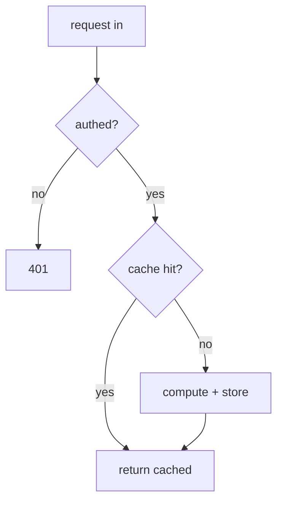
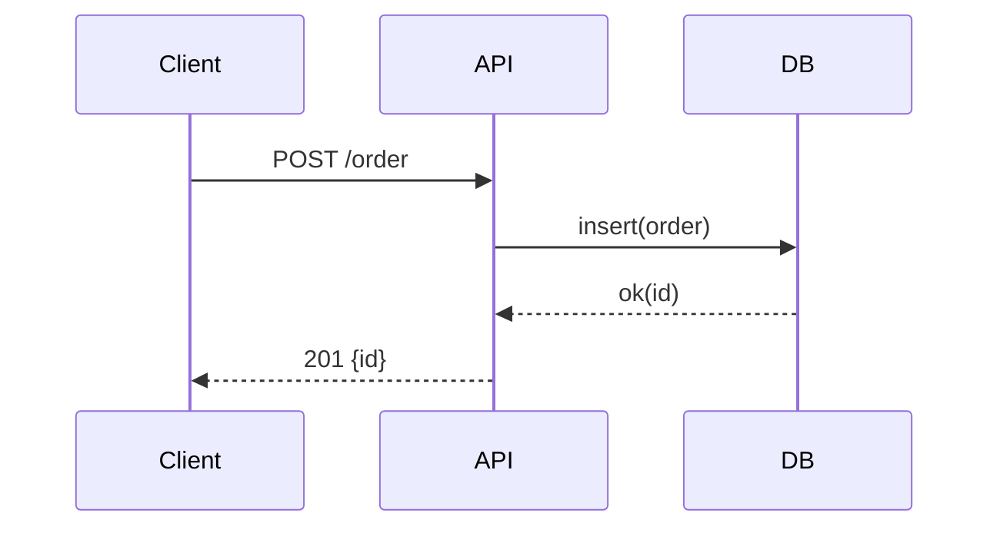
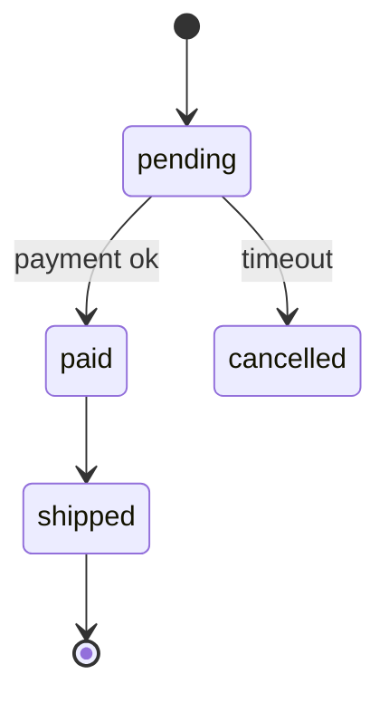

# Visualization guide — concept → format

Pick the format that matches the *shape* of the idea. A visual earns its place only if it lowers cognitive
load; if prose is clearer, use prose. Prefer Mermaid; fall back to ASCII or tables when Mermaid won't
render.

After showing any visual, verify it: have the learner explain it back, walk one concrete path, or point to
where a named edge case lives in it. A diagram shown is not a diagram understood.

| Concept you're teaching | Best format |
|---|---|
| Control flow, branching logic | Flowchart (`graph TD`) |
| Interactions between services / functions / users | Sequence diagram (`sequenceDiagram`) |
| Lifecycle / status transitions | State diagram (`stateDiagram-v2`) |
| Business rules, edge-case matrices | Table / truth table |
| Components and their dependencies | Architecture diagram (`graph LR`) |
| Migrations, incidents, rollouts, event ordering | Timeline / ordered list |
| Old behavior vs new behavior | Side-by-side table or two small diagrams |
| Step-by-step execution | Debugger-style trace table |
| Tradeoffs / alternatives / language differences | Comparison table |
| Memory, ownership, references, mutability, concurrency | Annotated diagram + table |

## Snippets to adapt

**Flowchart (control flow):**

**Sequence diagram (request/response lifecycle):**

**State diagram (lifecycle):**

**Trace table (step-by-step execution) — great for "predict the value":**

| step | line | i | sum | note |
|---|---|---|---|---|
| 1 | init | 0 | 0 | |
| 2 | loop | 1 | 1 | |
| 3 | loop | 2 | 3 | |

**Side-by-side (before/after):**

| | Before | After |
|---|---|---|
| reads | hit DB every call | cached 60s |
| failure mode | DB overload under spike | stale-but-up |

Use trace tables and "predict the next row" aggressively — prediction before reveal is where the learning
actually happens.
